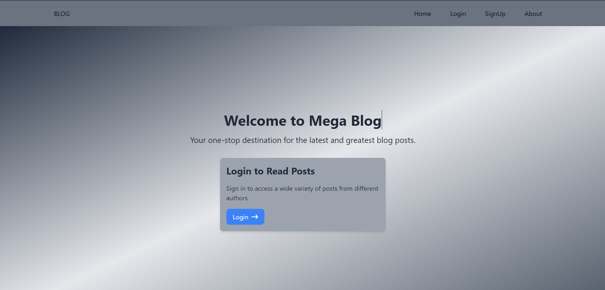
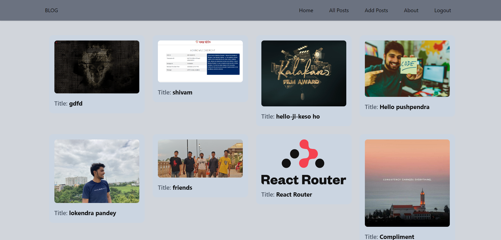
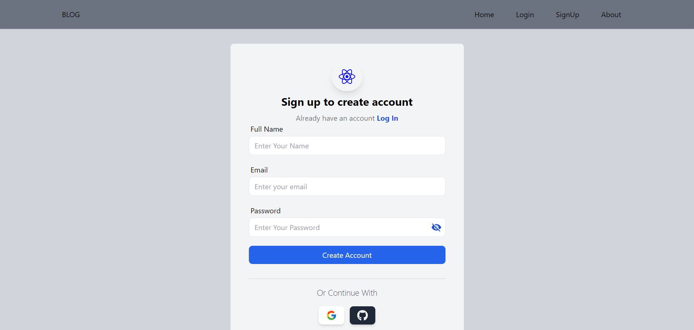
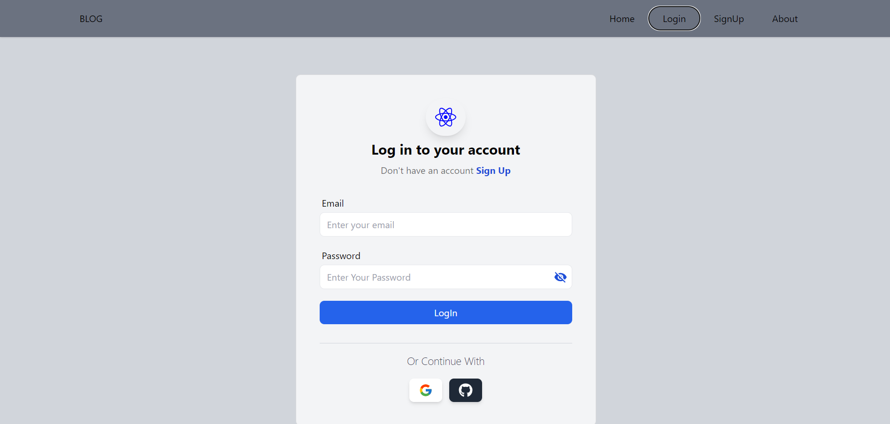
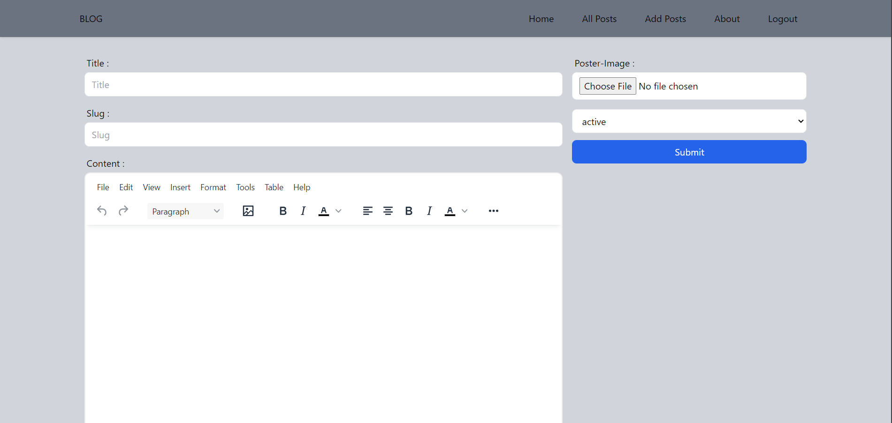
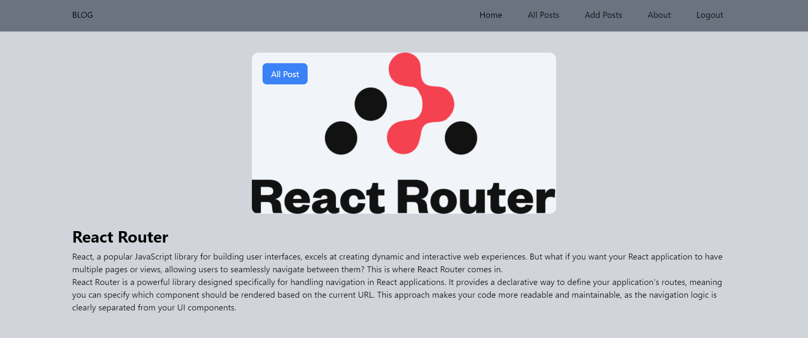
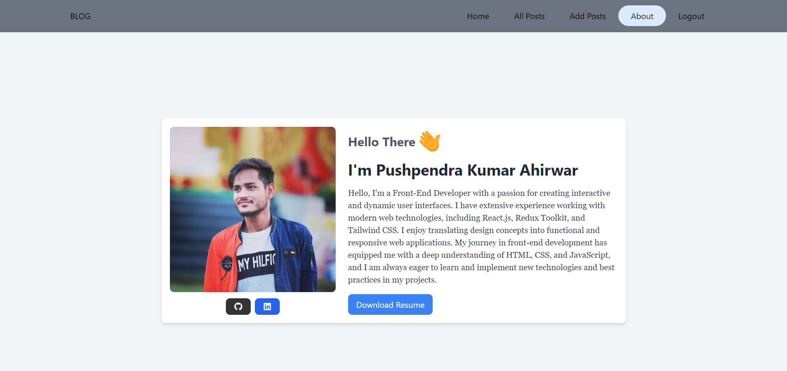

# Mega Blog

Mega Blog is a full-featured blogging platform where users can create, read, edit, and delete posts. The application includes user authentication, supports Google and GitHub login, and uses the latest web technologies to provide a seamless and responsive user experience.

## Live Demo

You can try out the live version of Mega Blog here: [Live Demo](https://mega-blog-woad.vercel.app/)

## Features

- **User Authentication**: Sign up and log in with email and password, or use Google and GitHub authentication.
- **Create, Read, Update, Delete (CRUD) Operations**: Users can add, edit, and delete their own blog posts.
- **Responsive Design**: Fully responsive layout using Tailwind CSS.
- **Rich Text Editor**: Includes TinyMCE editor for creating and editing posts.
- **React Toast Library**: Provides notifications for user actions and feedback.
- **Secure Password Handling**: Passwords are hashed before storage.

## Technologies Used

- **Frontend**: React, Redux, Tailwind CSS, React Hook Form, React Toastify, React Icons, React Router Dom
- **Backend**: Appwrite
- **Authentication**: Appwrite Authentication, Google Login, GitHub Login
- **Editor**: TinyMCE
- **Deployment**: Vercel

## Installation

To run this project locally, follow these steps:

1. Clone the repository:

    ```bash
    git clone https://github.com/yourusername/megablog.git
    cd megablog
    ```

2. Install dependencies:

    ```bash
    npm install
    ```

3. Set up environment variables:

    Create a `.env` file in the root of the project and add your Appwrite credentials, Google and GitHub client IDs, and other environment variables:

    ```env
    REACT_APP_APPWRITE_ENDPOINT=https://appwrite.io/v1
    REACT_APP_APPWRITE_PROJECT=your_project_id
    VITE_APPWRITE_DATABASE_ID=your_database_id
    VITE_APPWRITE_COLLECTION_ID=your_collection_id
    VITE_APPWRITE_BUCKET_ID=your_bucket_id
    VITE_EDITOR_API=your_your_editor_api
    ```

4. Start the development server:

    ```bash
    npm start
    ```

    The application will open in your default browser at `http://localhost:3000`.

## Pages

### Homepage (Without Login)



### Homepage (With User Login)



### Sign Up Page



### Login Page



### All Post Page


### Add Post Page



### Post Page



### About Page



## Usage

### Adding a Post

1. Log in to your account.
2. Navigate to the "Add Post" page.
3. Enter the title and content using the TinyMCE editor.
4. Click "Submit" to add your post.

### Editing a Post

1. Log in to your account.
2. Navigate to the post you want to edit.
3. Click the "Edit" button.
4. Make your changes using the TinyMCE editor.
5. Click "Save" to update your post.

### Deleting a Post

1. Log in to your account.
2. Navigate to the post you want to delete.
3. Click the "Delete" button.
4. Confirm the deletion.

### Notifications

The app uses the React Toastify library to provide notifications for user actions such as successful post creation, updates, and deletions. Notifications help users understand the result of their actions.

## Deployment

To deploy the application to Vercel:

1. Install the Vercel CLI:

    ```bash
    npm install -g vercel
    ```

2. Log in to Vercel:

    ```bash
    vercel login
    ```

3. Deploy the project:

    ```bash
    vercel
    ```

    Follow the prompts to configure your deployment. The app will be deployed to Vercel and accessible at your chosen domain.

## Contributing

Contributions are welcome! Please open an issue or submit a pull request for any changes.

## License

This project is licensed under the MIT License. See the [LICENSE](LICENSE) file for details.

## Contact

For any inquiries or feedback, please contact Pushpendra Kumar Ahirwar at [rajpushpendra19@gmail.com].
